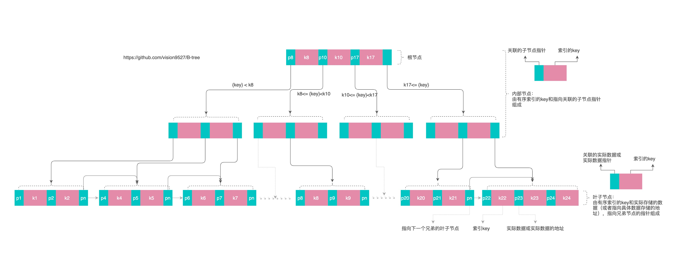

# B+树理论与实现
#### 1、B+树特点

1. 平衡多叉树，从根节点到所有叶子节点的高度相同
1. 叶子节点之间通过指针互连，方便遍历叶子节点
#### 2、B+树结构
1. 节点：由**索引key**和**值pointer**组成，每个节点都保存在一个磁盘的block上，一次IO读取一个block
1. 内部节点组成
    * 内部节点的元素为**索引key**和关联的**子节点指针**
1. 叶子节点组成
    * 叶子节点的元素为**索引key**和**实际数据或指向实际数据的地址**
    * 兄弟叶子节点之间通过指针互连
1. 左子树总是比右子树小，每个节点内部的索引key都是有序排列

#### 3、节点大小
1. key和pointer数量关系
    * key: n
    * pointer: n + 1
1. 如何计算n？
    * 内部节点：假设，n个索引，n+1指针，block大小4096B，一个指针4B，一个索引4B
        * 4\*n+4\*(n+1) = 4096
        * n = 512
    * 叶子节点：假设，n个索引，n+1指针，block大小4096B，一个数据64B，一个索引4B
        * 64\*n+4\*(n+1) = 4096
        * n = 60
1. 半满条件
    * n/2+1

1. 一般3层高度的B+树即可保存千万级别的数据，如何计算一颗B+树能保存的数据量？
    * 根据以上的计算数据可推出，512 * 512 * 60 = 15728640
    * 约保存1千万左右数据

#### 4. mysql选择B+树而不是B树原因
1. B+树查询在范围查询效率更高，B+树在范围查询可以根据叶子节点的链接直接顺序遍历，B树需要遍历完子树才能完成范围查找，访问的磁盘IO次数更多
2. B+树查询效率更稳定，B+树每次访问数据都会到达叶子节点，查询时间稳定，而B树访问的数据不确定在第几层所以查询效率不太稳定